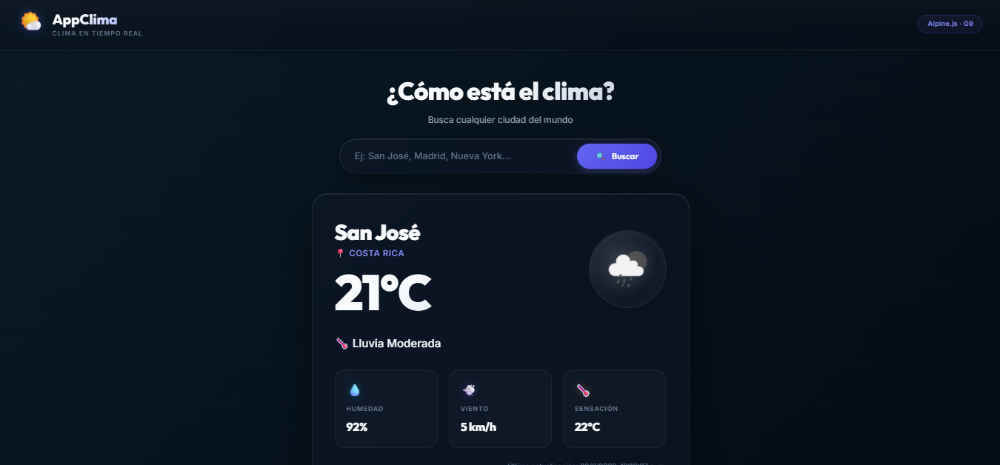

# 🌤️ AppClima — Aplicación del Clima en Tiempo Real

> **Grupo G9 · Desarrollo Web · Universidad**
>
> Aplicación web académica que consulta el clima en tiempo real usando **Alpine.js** como framework de frontend y **Node.js + Express** como backend intermediario.

---

## 📋 Descripción

**AppClima** permite consultar el clima actual de cualquier ciudad del mundo. Muestra temperatura, descripción, humedad, velocidad del viento y el ícono oficial del clima. Al cargar, muestra automáticamente el clima de **San José, Costa Rica**.

La aplicación demuestra el uso de **Alpine.js** y los conceptos del curso: HTML semántico, CSS avanzado, JavaScript moderno, módulos ESM, asincronía, Node.js y Express.

---

## 🛠️ Framework Utilizado

### Alpine.js

**Alpine.js** es un framework JavaScript minimalista que agrega reactividad directamente en el HTML mediante atributos especiales (`x-data`, `x-model`, etc.). Es ideal para añadir comportamiento dinámico sin la complejidad de Vue o React.

```html
<div x-data="{ message: 'Hola Mundo' }">
  <p x-text="message"></p>
</div>
```

---

## 🚀 Tecnologías Utilizadas

| Capa | Tecnología | Propósito |
|------|-----------|-----------|
| Frontend | **Alpine.js v3** | Framework reactivo |
| Frontend | **HTML5 Semántico** | Estructura |
| Frontend | **CSS3 (Vanilla)** | Estilos, animaciones, responsive |
| Frontend | **JavaScript ESM** | Módulos, lógica de cliente |
| Backend | **Node.js** | Servidor JavaScript |
| Backend | **Express.js** | Framework web para API |
| API | **OpenWeatherMap** | Datos meteorológicos en tiempo real |
| Persistencia | **localStorage** | Historial de búsquedas |

---

## 📦 Instalación

### Prerrequisitos

- **Node.js** v18 o superior — [Descargar](https://nodejs.org)
- **Cuenta en OpenWeatherMap** — [Registrarse gratis](https://openweathermap.org/api)

### Paso 1: Clonar el repositorio

```bash
git clone https://github.com/tu-usuario/AppClima.git
cd AppClima
```

### Paso 2: Instalar dependencias del backend

```bash
cd backend
npm install
```

### Paso 3: Configurar la API Key

```bash
# Dentro de la carpeta backend/
cp .env.example .env
```

Editar el archivo `.env`:

```env
OPENWEATHER_API_KEY=tu_api_key_aqui
PORT=3000
```

> ⚠️ **Nunca subas el archivo `.env` al repositorio. Está en `.gitignore`.**

---

## ▶️ Ejecución

### Backend (Express)

```bash
cd backend
npm run dev     # Desarrollo (con nodemon)
# o
npm start       # Producción
```

El servidor estará en: `http://localhost:3000`

### Frontend

El frontend es servido automáticamente por Express desde la carpeta `frontend/`. Simplemente abre el navegador en:

```
http://localhost:3000
```

No se necesita un servidor separado para el frontend.

---

## 🔑 Configuración de la API Key

1. Ve a [https://openweathermap.org/api](https://openweathermap.org/api)
2. Crea una cuenta gratuita
3. En tu perfil, ve a **"My API Keys"**
4. Copia tu API Key
5. Pégala en el archivo `backend/.env`

```env
OPENWEATHER_API_KEY=abc123def456...
```

> **Nota**: Las API Keys nuevas pueden tardar hasta 2 horas en activarse.

---

## 🏗️ Arquitectura

```
┌─────────────────────────────────────────────┐
│              CLIENTE (Navegador)            │
│                                             │
│   Alpine.js + HTML + CSS + JS (ESM)         │
│   ┌──────────────────────────────────────┐  │
│   │  frontend/index.html                 │  │
│   │  frontend/js/app.js      (Alpine)    │  │
│   │  frontend/services/weatherService.js │  │
│   │  frontend/utils/helpers.js           │  │
│   └──────────────────────────────────────┘  │
└─────────────────┬───────────────────────────┘
                  │  GET /api/weather/:city
                  │  (fetch HTTP al backend)
┌─────────────────▼───────────────────────────┐
│              BACKEND (Node.js + Express)    │
│                                             │
│   backend/server.js                         │
│   backend/routes/weatherRoutes.js           │
│   backend/controllers/weatherController.js  │
│                                             │
│   Variables de entorno: backend/.env        │
└─────────────────┬───────────────────────────┘
                  │  HTTPS + API Key (segura)
                  │  (La API Key NUNCA llega al cliente)
┌─────────────────▼───────────────────────────┐
│          OpenWeatherMap API                 │
│  https://api.openweathermap.org/data/2.5/   │
│  weather?q={city}&appid={key}&units=metric  │
└─────────────────────────────────────────────┘
```

### Flujo de datos

1. El usuario escribe una ciudad y presiona **Buscar**
2. Alpine.js llama a `fetchWeather(city)` en `app.js`
3. `weatherService.js` hace `fetch` al endpoint `/api/weather/:city`
4. Express recibe la petición en `weatherRoutes.js`
5. `weatherController.js` consulta OpenWeatherMap con la API Key (guardada en `.env`)
6. El backend retorna solo los datos necesarios al frontend
7. Alpine.js actualiza el DOM reactivamente

---

## 📸 Capturas de Pantalla

> _Insertar capturas aquí después del despliegue_

| Vista principal | Error | Historial |
|---|---|---|
|  |  |  |

---

## 🌐 URL Demo

> _Insertar URL de Vercel/Render/Railway después del despliegue_

```
https://appclima-g9.vercel.app
```

---

## 🧩 Conceptos de Alpine.js Utilizados

### `x-data`
Define el estado reactivo del componente. Todos los datos del componente viven aquí.

```html
<div x-data="weatherApp()">
  <!-- Todo el componente tiene acceso al estado -->
</div>
```

### `x-model`
Binding bidireccional entre el input y una variable del estado. El input actualiza la variable y viceversa.

```html
<input x-model="searchQuery" placeholder="Ciudad..." />
```

### `x-show`
Muestra u oculta un elemento según una condición booleana. Usa `display: none` internamente.

```html
<div x-show="loading">⏳ Cargando...</div>
<div x-show="hasError">⚠️ Error</div>
```

### `x-text`
Actualiza el contenido de texto de un elemento reactivamente.

```html
<span x-text="weather.temperature + '°C'"></span>
```

### `x-for`
Itera sobre un array y renderiza un `<template>` por cada elemento.

```html
<template x-for="city in history" :key="city">
  <button x-text="city"></button>
</template>
```

### `x-on` / `@click` / `@keyup.enter`
Manejadores de eventos en el HTML. `@` es un alias de `x-on:`.

```html
<button @click="search()">Buscar</button>
<input @keyup.enter="search()" />
<form @submit.prevent="search()"></form>
```

### `x-bind` / `:`
Vincula atributos HTML a expresiones JavaScript dinámicamente.

```html

<div :class="weatherClass"></div>
```

### `x-cloak`
Oculta el elemento hasta que Alpine termina de inicializarse, evitando el flash de contenido sin estilo.

```css
[x-cloak] { display: none !important; }
```

---

## ✅ Ventajas de Alpine.js

| Ventaja | Descripción |
|---------|-------------|
| **Ligero** | ~15KB comprimido, sin dependencias |
| **Sin build** | Se usa directamente desde CDN, sin Webpack/Vite |
| **Declarativo** | La reactividad se define en el HTML, muy legible |
| **Curva baja** | Si conoces HTML/JS, aprendes Alpine en horas |
| **Compatible** | Funciona con cualquier backend (Express, Laravel, etc.) |
| **Progresivo** | Se puede agregar a proyectos existentes sin romper nada |

## ❌ Desventajas de Alpine.js

| Desventaja | Descripción |
|------------|-------------|
| **Sin estado global** | No tiene Vuex/Redux; para apps grandes es limitado |
| **Sin SSR nativo** | No soporta Server-Side Rendering como Next.js |
| **Ecosistema pequeño** | Menos plugins y componentes que React/Vue |
| **Debugging difícil** | No tiene DevTools tan avanzadas como Vue DevTools |
| **Sin TypeScript oficial** | Soporte TS limitado comparado con Angular/React |
| **Escalabilidad** | No es ideal para apps muy grandes y complejas |

---

## 📁 Estructura del Proyecto

```
AppClima/
├── backend/
│   ├── controllers/
│   │   └── weatherController.js  ← Lógica de consulta a OWM
│   ├── routes/
│   │   └── weatherRoutes.js      ← Rutas Express
│   ├── server.js                 ← Servidor Express principal
│   ├── .env.example              ← Plantilla de variables de entorno
│   └── package.json
│
├── frontend/
│   ├── css/
│   │   └── styles.css            ← Estilos (variables, grid, animaciones)
│   ├── js/
│   │   └── app.js                ← Componente Alpine.js principal
│   ├── services/
│   │   └── weatherService.js     ← Fetch al backend (ESM)
│   ├── utils/
│   │   └── helpers.js            ← Funciones utilitarias (ESM)
│   └── index.html                ← HTML semántico principal
│
├── .gitignore
├── README.md                     ← Este archivo
└── REFERENCIAS.md                ← Referencias académicas
```

---

## 🎓 Conceptos del Curso Demostrados

| Tema | Implementación | Archivo |
|------|---------------|---------|
| HTML semántico | `<header>`, `<main>`, `<section>`, `<article>`, `<footer>`, `<form>` | `index.html` |
| CSS Base | Selectores, reset, organización | `styles.css` |
| Layouts CSS | Flexbox + CSS Grid | `styles.css` |
| CSS Avanzado | Variables, transiciones, animaciones, glassmorphism | `styles.css` |
| JavaScript Moderno | `const`, `let`, objetos, arrays | `app.js`, `helpers.js` |
| JavaScript Avanzado | Arrow functions, destructuring, template literals, spread | Todos los `.js` |
| Eventos | `@click`, `@keyup.enter`, `@submit.prevent` | `index.html` |
| DOM | Solo via Alpine.js (sin `document.write`) | `app.js` |
| Módulos ESM | `import`/`export` en módulos separados | `services/`, `utils/` |
| Asincronía | `fetch`, `async/await`, `try/catch` | `weatherService.js`, `app.js` |
| Rendimiento | `localStorage`, sin llamadas duplicadas | `helpers.js`, `app.js` |
| Node.js | Servidor con variables de entorno | `server.js` |
| Express | Rutas, controladores, middleware | `routes/`, `controllers/` |

---

## 👥 Autores

**Grupo G9 — Desarrollo Web**

---

## 📄 Licencia

MIT License — Uso académico libre.
